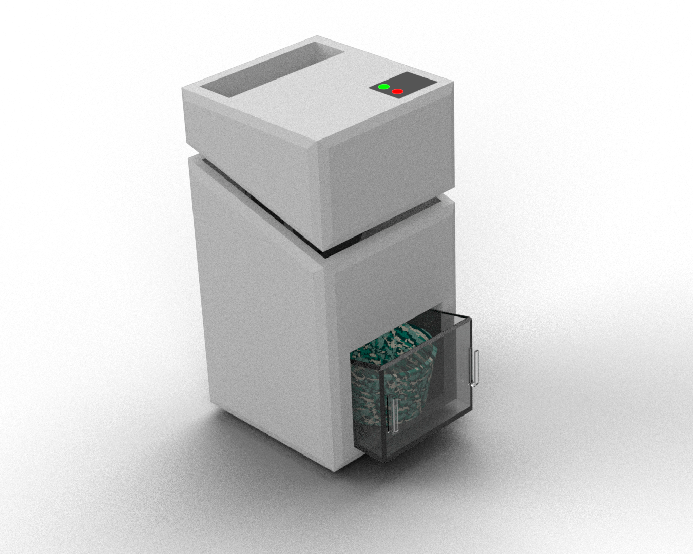

# 🧩 3D Product Design

A collection of 3D product design models created in SolidWorks for learning and prototyping purposes. Each design focuses on both visual appeal and manufacturability.

## 🏎️ Tamiya Mini Race Car

A conceptual design of a Tamiya-style mini race car, created to demonstrate basic CAD modeling and assembly techniques.

---

## 🗑️ Eco-Friendly Trash Bin

A 3D model of an environmentally friendly trash bin, designed with usability and sustainability in mind. This project emphasizes function-oriented design and ergonomics.

---

Feel free to explore the designs above. If you’d like to access the complete design files, don’t hesitate to reach out to me.
